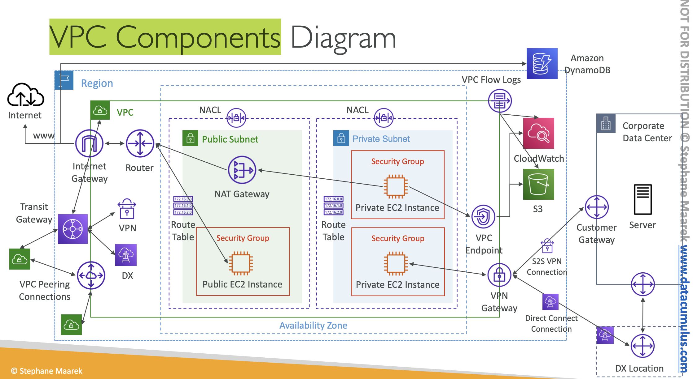

# vpc

[introduction](https://www.udemy.com/course/aws-certified-solutions-architect-associate-saa-c03/learn/lecture/13528534#overview) - covers all of this stuff

[cidr vs public ip](https://www.udemy.com/course/aws-certified-solutions-architect-associate-saa-c03/learn/lecture/13528536#lecture-article) - Classless Inter-Domain Routing
* **base ip** e.g. `10.0.0.0`
* **subnet mask** - how many bits can change in the ip address. e.g. `/0` (everything), `/32` (only 1 ip address), or it can look like `255.0.0.0` aka `/8`
* between the base ip + subnet mask is **a range of ip addresses*
* common ranges: 
    * `/32`: a single IP address
    * `/24`: last octet can change, e.g. e.g. `192.168.0.0` - `192.168.0.255`
    * `/16`: last 2 can change
    * `/8`: last 3 can change
    * `/0`: EVERYTHING CHANGES AND NOTHING STAYS THE SAME
    * each step down means either halving or doubling. so `/31` is 2, `/30` is 2^2... 
* private IP address ranges defined by IANA: 
    * `10.0.0.0/8`: A large private IP range commonly used in big networks.
    * `172.16.0.0/12`: Another private IP range. - **default aws vpc**
    * `192.168.0.0/16`: Typically used for home networks; devices connected to a home router often have IPs starting with 192.
    * All other IP addresses outside these ranges are public IP addresses used on the internet
* check with tooling: [https://www.ipaddressguide.com/cidr](https://www.ipaddressguide.com/cidr)

[default vpc overview](https://www.udemy.com/course/aws-certified-solutions-architect-associate-saa-c03/learn/lecture/13528538#lecture-article)
* all accounts come with 1, they're all internet connected, all ec2 inside got public ipv4. also public and private ipv4 address
* range is `172.31.0.0/16`, 65535 addresses
* dhcp options, main route table, main network acl, default tenancy
    * default network acl is all allow from all protocol etc
    * provisions default internt gateway and puts it in the main route table
* default has 3 subnets within 3 azs, each about 4k available ips. each subnet -5 ip from the theoretical pool for aws reserved stuff
* just make sure your vpc cidr doesn't overlap with corporate network etc

[vpc hands on](https://www.udemy.com/course/aws-certified-solutions-architect-associate-saa-c03/learn/lecture/28874472#lecture-article) + [create subnet](https://www.udemy.com/course/aws-certified-solutions-architect-associate-saa-c03/learn/lecture/13528542#lecture-article)
* manual clickops creation urgh
* reserved IPs: 
    * The first IP address, which is the network address.
    * The second IP address (.1), reserved by AWS for the VPC router.
    * The third IP address (.2), reserved by AWS for mapping to Amazon provided DNS.
    * The fourth IP address (.3), which is currently not used but reserved for future use.
    * The last IP address (.255), which is the network broadcast address. (but aws doesn't support this lo)
* specify the AZ and cidr block

[internet gateway](https://www.udemy.com/course/aws-certified-solutions-architect-associate-saa-c03/learn/lecture/13528544#lecture-article) + bff **route table** + [hands on](https://www.udemy.com/course/aws-certified-solutions-architect-associate-saa-c03/learn/lecture/28874492#lecture-article)
* create separately from the VPC
* will allow resources in the VPC to acces the internet. horizontally scaling + HA + redundant
* *IGW themselves can't allow access, need to also edit the route table*
* go VPC console and check no igw. create igw, and then attach igw to vpc. note, this makes some implicit associations, but explciit is probably better. then create route table, public route table for public subnets. private route table for private subnets. edit route for public route table to add `0.0.0.0/0`, target igw

[bastion hosts](https://www.udemy.com/course/aws-certified-solutions-architect-associate-saa-c03/learn/lecture/13528558#lecture-article) + [hands on](https://www.udemy.com/course/aws-certified-solutions-architect-associate-saa-c03/learn/lecture/28874510#lecture-article)
* special EC2 instance placed in a public subnet, has its own security group, can access ec2 instances in the private subnet because it's in the same VPC as the private subnet
* we did this at work (this also applies to EKS cluster nodes KEK): 
    * connect via SSH to the bastion host
    * from the bastion host, connect again via SSH to the EC2 instance in the private subnet
    * bastion host security group must allow inbound from internet on port 22 from specific cidr ranges e.g. corporation or personal ip ranges
    * remember to generate key pair etc, change permissions

[nat instances - outdated vs nat gateway](https://www.udemy.com/course/aws-certified-solutions-architect-associate-saa-c03/learn/lecture/13528548#lecture-article) + [hands on](https://www.udemy.com/course/aws-certified-solutions-architect-associate-saa-c03/learn/lecture/28874518#lecture-article)
* NAT instances enable EC2 instances in private subnets to access the internet by routing traffic through a NAT instance in a public subnet.
* The NAT instance rewrites the source IP address of outgoing packets to its own Elastic IP, allowing return traffic to be routed correctly.
* Source/destination checks must be disabled on the NAT instance to allow it to forward traffic properly.
* ***NAT instances are outdated, not highly available by default, and require manual management; NAT gateways are the recommended modern solution.***

[nat gateways](https://www.udemy.com/course/aws-certified-solutions-architect-associate-saa-c03/learn/lecture/13528550#lecture-article)
* aws managed nat instances - managed, high-bandwidth, and highly available solution for enabling internet access from private subnets
* requires an internet gateway (private -> natgw -> igw)
* **deployed in public subnets** and route traffic from private subnets to the internet gateway; need multiple gateways in different AZs for high availability
* require no security group management and cannot be used as bastion hosts, unlike NAT instances

[security groups and nacls](https://www.udemy.com/course/aws-certified-solutions-architect-associate-saa-c03/learn/lecture/13528552#lecture-article)
* nacl is at the subnet level, before the security group/ec2 instance
* **nacls are stateless*; security groups are stateful - outbound response is automatically allowed by the security group without evaluating outbound rules. nacl however, outbound rules are evaluated separately,  so can still deny the outbound request.
* nacl vs security group:
    * Security groups operate at the instance level, while NACLs operate at the subnet level.
    * Security groups support allow rules only; NACLs support both allow and deny rules, enabling blocking of specific IP addresses.
    * Security groups are stateful, automatically allowing return traffic regardless of rules; NACLs are stateless, requiring evaluation of inbound and outbound rules separately.
    * For security groups, all rules are evaluated to decide whether to allow traffic; for NACLs, the rule with the highest priority (lowest number) that matches is applied first.
    * Security groups apply to specific EC2 instances as assigned; NACLs apply to all EC2 instances within the associated subnet.
