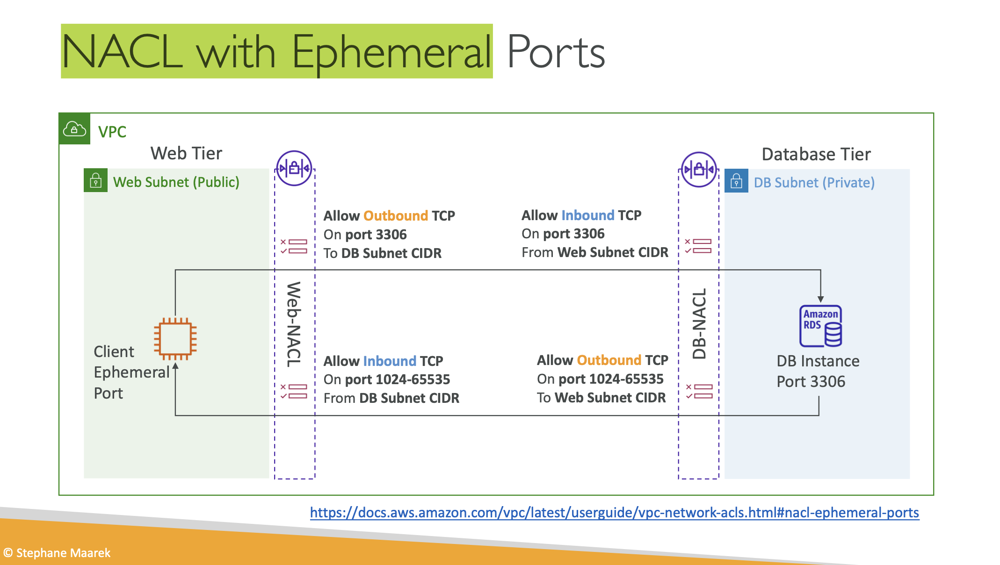

# vpc

[introduction](https://www.udemy.com/course/aws-certified-solutions-architect-associate-saa-c03/learn/lecture/13528534#overview) - covers all of this stuff


[cidr vs public ip](https://www.udemy.com/course/aws-certified-solutions-architect-associate-saa-c03/learn/lecture/13528536#lecture-article) - Classless Inter-Domain Routing
* **base ip** e.g. `10.0.0.0`
* **subnet mask** - how many bits can change in the ip address. e.g. `/0` (everything), `/32` (only 1 ip address), or it can look like `255.0.0.0` aka `/8`
* between the base ip + subnet mask is **a range of ip addresses*
* common ranges: 
    * `/32`: a single IP address
    * `/24`: last octet can change, e.g. e.g. `192.168.0.0` - `192.168.0.255`
    * `/16`: last 2 can change
    * `/8`: last 3 can change
    * `/0`: EVERYTHING CHANGES AND NOTHING STAYS THE SAME
    * each step down means either halving or doubling. so `/31` is 2, `/30` is 2^2... 
* private IP address ranges defined by IANA: 
    * `10.0.0.0/8`: A large private IP range commonly used in big networks.
    * `172.16.0.0/12`: Another private IP range. - **default aws vpc**
    * `192.168.0.0/16`: Typically used for home networks; devices connected to a home router often have IPs starting with 192.
    * All other IP addresses outside these ranges are public IP addresses used on the internet
* check with tooling: [https://www.ipaddressguide.com/cidr](https://www.ipaddressguide.com/cidr)


[default vpc overview](https://www.udemy.com/course/aws-certified-solutions-architect-associate-saa-c03/learn/lecture/13528538#lecture-article)
* all accounts come with 1, they're all internet connected, all ec2 inside got public ipv4. also public and private ipv4 address
* range is `172.31.0.0/16`, 65535 addresses
* dhcp options, main route table, main network acl, default tenancy
    * default network acl is all allow from all protocol etc
    * provisions default internt gateway and puts it in the main route table
* default has 3 subnets within 3 azs, each about 4k available ips. each subnet -5 ip from the theoretical pool for aws reserved stuff
* just make sure your vpc cidr doesn't overlap with corporate network etc

[vpc hands on](https://www.udemy.com/course/aws-certified-solutions-architect-associate-saa-c03/learn/lecture/28874472#lecture-article) + [create subnet](https://www.udemy.com/course/aws-certified-solutions-architect-associate-saa-c03/learn/lecture/13528542#lecture-article)
* manual clickops creation urgh
* reserved IPs: 
    * The first IP address, which is the network address.
    * The second IP address (.1), reserved by AWS for the VPC router.
    * The third IP address (.2), reserved by AWS for mapping to Amazon provided DNS.
    * The fourth IP address (.3), which is currently not used but reserved for future use.
    * The last IP address (.255), which is the network broadcast address. (but aws doesn't support this lo)
* specify the AZ and cidr block

[internet gateway](https://www.udemy.com/course/aws-certified-solutions-architect-associate-saa-c03/learn/lecture/13528544#lecture-article) + bff **route table** + [hands on](https://www.udemy.com/course/aws-certified-solutions-architect-associate-saa-c03/learn/lecture/28874492#lecture-article)
* create separately from the VPC
* will allow resources in the VPC to acces the internet. horizontally scaling + HA + redundant
* *IGW themselves can't allow access, need to also edit the route table*
* go VPC console and check no igw. create igw, and then attach igw to vpc. note, this makes some implicit associations, but explciit is probably better. then create route table, public route table for public subnets. private route table for private subnets. edit route for public route table to add `0.0.0.0/0`, target igw

[bastion hosts](https://www.udemy.com/course/aws-certified-solutions-architect-associate-saa-c03/learn/lecture/13528558#lecture-article) + [hands on](https://www.udemy.com/course/aws-certified-solutions-architect-associate-saa-c03/learn/lecture/28874510#lecture-article)
* special EC2 instance placed in a public subnet, has its own security group, can access ec2 instances in the private subnet because it's in the same VPC as the private subnet
* we did this at work (this also applies to EKS cluster nodes KEK): 
    * connect via SSH to the bastion host
    * from the bastion host, connect again via SSH to the EC2 instance in the private subnet
    * bastion host security group must allow inbound from internet on port 22 from specific cidr ranges e.g. corporation or personal ip ranges
    * remember to generate key pair etc, change permissions

[nat instances - outdated vs nat gateway](https://www.udemy.com/course/aws-certified-solutions-architect-associate-saa-c03/learn/lecture/13528548#lecture-article) + [hands on](https://www.udemy.com/course/aws-certified-solutions-architect-associate-saa-c03/learn/lecture/28874518#lecture-article)
* NAT instances enable EC2 instances in private subnets to access the internet by routing traffic through a NAT instance in a public subnet.
* The NAT instance rewrites the source IP address of outgoing packets to its own Elastic IP, allowing return traffic to be routed correctly.
* Source/destination checks must be disabled on the NAT instance to allow it to forward traffic properly.
* ***NAT instances are outdated, not highly available by default, and require manual management; NAT gateways are the recommended modern solution.***

[nat gateways](https://www.udemy.com/course/aws-certified-solutions-architect-associate-saa-c03/learn/lecture/13528550#lecture-article)
* aws managed nat instances - managed, high-bandwidth, and highly available solution for enabling internet access from private subnets
* requires an internet gateway (private -> natgw -> igw)
* **deployed in public subnets** and route traffic from private subnets to the internet gateway; need multiple gateways in different AZs for high availability
* require no security group management and cannot be used as bastion hosts, unlike NAT instances

[security groups and nacls](https://www.udemy.com/course/aws-certified-solutions-architect-associate-saa-c03/learn/lecture/13528552#lecture-article)
* nacl vs security group:
    * Security groups operate at the instance level, while NACLs operate at the subnet level. 
    * Security groups support allow rules only; NACLs support both allow and deny rules, enabling blocking of specific IP addresses.
    * **nacls are stateless**; security groups are stateful - outbound response is automatically allowed by the security group without evaluating outbound rules. nacl however, outbound rules are evaluated separately,  so can still deny the outbound request.
    * For security groups, all rules are evaluated to decide whether to allow traffic; for NACLs, the rule with the highest priority (lowest number) that matches is applied first.
    * Security groups apply to specific EC2 instances as assigned; NACLs apply to all EC2 instances within the associated subnet.
* NACL: 
    * **One per subnet**
    * **Default NACL** accepts everything inbound/outbound
        * Don't modify the default NACL, just create a new one
    * Number (1-32766) determines precedence, lower is higher precedence
    * First rule match will drive the decision
    * **AWS recommendation add in increments of 100**
    * Newly created NACL will deny everything - last rule is * and denies a request as a catchall if no rules match
    * Great for blocking specific IPs at the subnet level

```
# default nacl for ipv4 vpc - inbound/outbound
Rule 100 - 0.0.0.0/0 ALLOW all protocols
Rule * - 0.0.0.0/0 DENY all protocols (never gets evaluated)
```

* ephemeral ports: for any two endpoints to establish a connection they must use ports. clients connect to a defined port on the server, and expect a response on an ephemeral port that the client opens for the server's response
* different OSes use different port ranges e.g. common in linux kernels 32768-60999
* this is also a thing for muh self-hosted dns sink instance (currently pihole), which i configured with ansible
* [aws documentation](https://docs.aws.amazon.com/vpc/latest/userguide/vpc-network-acls.html) on nacls



[nacls and sgs hands on](https://www.udemy.com/course/aws-certified-solutions-architect-associate-saa-c03/learn/lecture/28874530#lecture-article)
* default NACL of vpc is associated with the subnets created in the vpcs
* bastion host - set up web server, edit security group to allow http traffic
* attempt to create a nacl rule with precedence to deny inbound http traffic - demo that the rules work to block traffic, delete outbound rules from security group to show that it's stateful (which cos got inbound, still can send out)

[vpc peering](https://www.udemy.com/course/aws-certified-solutions-architect-associate-saa-c03/learn/lecture/13528554#lecture-article)
* create VPCs in different regions or different accounts, and we want to connect them together using the AWS network -- **behave as if they were in the same network**
* ***VPC network CIDRs must be distant from each other*** - if they have overlapping cidrs they can't communicate
* **not transitive**: each VPC must be peered with another directly. e.g. A with B, and B with C. A won't be able to talk to C.
* **must update route table** in each vpc's subnets to ensure they can talk to each other
* can reference security groups within a security group - reference a security group from a peered VPC across accounts in the same region, no need to reference cidr/ip across accounts

[vpc peering hands on](https://www.udemy.com/course/aws-certified-solutions-architect-associate-saa-c03/learn/lecture/28874554#lecture-article)
* `one in the demo VPC, which we will refer to as the BastionHost, and the other in the default VPC, which we will call the default VPC instance. Our objective is to verify connectivity between these two instances`
* `BastionHost has an IP address in the 10.0.0.0/16 range, while the default VPC instance has an IP address in the 172.31.36.159 range. This indicates that they reside in different VPCs with distinct CIDR blocks.`
* `curl request to the default VPC instance's private IP address on port 80, which returns a "hello world" response, confirming connectivity from BastionHost to default VPC instance; attempt the same curl request from the default VPC instance to the BastionHost's private IP address, the request times out. This demonstrates that, by default, instances in separate VPCs cannot communicate with each other due to network isolation`. 
* **create vpc peering connection** - set requester and acceper vpcs, then need to go and accept peering request - 'pending acceptance' til it's accepted. then **must add routes to the route tables of one or both VPCs** -  in default vpc, `route with the destination set to the CIDR block of the demo VPC and the target set to the peering connection`. in demo vpc, add `add a route with the destination set to the CIDR block of the default VPC and the target set to the same peering connection`

[vpc endpoints](http://udemy.com/course/aws-certified-solutions-architect-associate-saa-c03/learn/lecture/13528556#lecture-article)
* use VPC endpoints so your instances do not have to traverse the public internet - go thru aws network
* `For example, an EC2 instance in a private subnet accesses Amazon SNS by routing through the NAT gateway, then the internet gateway, and finally to the Amazon SNS service publicly. Similarly, an EC2 instance in a public subnet accesses Amazon SNS directly through the internet gateway. While this approach works, it incurs costs because the NAT gateway charges fees. The internet gateway itself does not have a cost, but the multiple hops make this method inefficient.`
* `Every AWS service is publicly exposed with a public URL. When you use VPC endpoints, they are powered by AWS PrivateLink, enabling private access to these services over the AWS network instead of the public internet.`
* redundant and scale horizontally, eliminate need for internet/NAT gateway to access AWS services
* **interface endpoints**
    * provisions an elastic network interface with private ip address in vpc - need to *attach **security group*** (cos of the eni)
    * supports most aws services 
    * $/hour + $/gb of data processed
* **gateway endpoints**
    * provision a gateway used as a target in a route table, **don't use IP or security group**
    * **only supports s3 and dynamo**
    * free and scale automatically since only involve route table
* for the exam - gateway endpoint is preferred cos free and scales better. if private access from on prem using site-to-site VPN or Direct Connect, or connect from another vpc thru **interface endpoint** (advanced use cases)